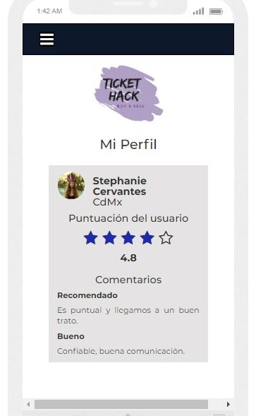

# Ticket-Hack

Plataforma que busca ofrecer un espacio para el intercambio de boletos, principalmente para conciertos, desde una comunidad segura y confiable.
##Desarrollado para Laboratoria (http://laboratoria.la)

 User Research
Personas que asisten comúnmente a conciertos, que buscan o venden boletos con otros usuarios.
Supuestos
Las aplicaciones para la búsqueda de boletos están enfocadas en vender boletos con empresas o promotores encargados de los conciertos, dejando en segundo plano la interacción entre usuarios.
Los usuarios necesitan un espacio donde puedan buscar y vender boletos con precios dinámicos, para posteriormente generar una comunidad de confianza de intercambio de boletos para conciertos.

 Pain Points
•	Búsqueda rápida de boletos
•	Comprar y vender boletos entre los usuarios
•	Negociación y precios dinámicos de boletos
•	Confiabilidad de venta – usuario raiting

 Objetivo
Crear una app donde los usuarios puedan buscar y vender boletos de conciertos de forma rápida y confiable.

 Perfil
•	El usuario va complementando su perfil de acuerdo a su historial de compra y venta, donde las personas que cerraron trato con el pueden calificar al usuario y dejar comentarios sobre sus experiencias.

 Retos
•	Que los usuarios utilicen la aplicación como medio de intercambio de boletos
•	Crear una comunidad confiable y segura para la venta e intercambio de boletos

 Cronograma de actividades

 Sketching

 Roles

- Mayra Cruz: Investigación, API, Funcionalidad.
- Gabriela López: Investigación, API, Funcionalidad.
- Adalid Garcia: Investigación, API, Funcionalidad.
- Karla Miranda: Investigación, UX, Maquetado.

Trabajo escolar;

